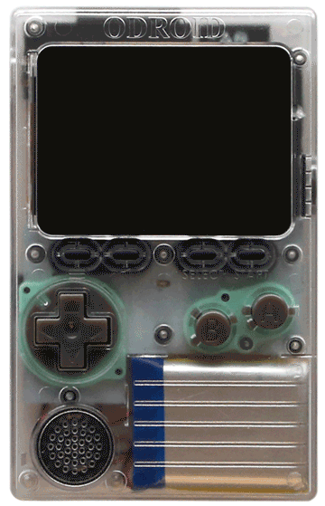

# 
> Retro ESP32 is a turbo charged Odroid Go Launcher, Emulator and ROM Manager

[![Downloads](https://img.shields.io/github/downloads/retro-esp32/RetroESP32/total?style=for-the-badge&color=hotpink&logo=data:image/gif;base64,R0lGODlhYgB3AKIFAMwAAN9fX/THx88PD////////wAAAAAAACH/C1hNUCBEYXRhWE1QPD94cGFja2V0IGJlZ2luPSLvu78iIGlkPSJXNU0wTXBDZWhpSHpyZVN6TlRjemtjOWQiPz4gPHg6eG1wbWV0YSB4bWxuczp4PSJhZG9iZTpuczptZXRhLyIgeDp4bXB0az0iQWRvYmUgWE1QIENvcmUgNS42LWMxMzggNzkuMTU5ODI0LCAyMDE2LzA5LzE0LTAxOjA5OjAxICAgICAgICAiPiA8cmRmOlJERiB4bWxuczpyZGY9Imh0dHA6Ly93d3cudzMub3JnLzE5OTkvMDIvMjItcmRmLXN5bnRheC1ucyMiPiA8cmRmOkRlc2NyaXB0aW9uIHJkZjphYm91dD0iIiB4bWxuczp4bXA9Imh0dHA6Ly9ucy5hZG9iZS5jb20veGFwLzEuMC8iIHhtbG5zOnhtcE1NPSJodHRwOi8vbnMuYWRvYmUuY29tL3hhcC8xLjAvbW0vIiB4bWxuczpzdFJlZj0iaHR0cDovL25zLmFkb2JlLmNvbS94YXAvMS4wL3NUeXBlL1Jlc291cmNlUmVmIyIgeG1wOkNyZWF0b3JUb29sPSJBZG9iZSBQaG90b3Nob3AgQ0MgMjAxNyAoTWFjaW50b3NoKSIgeG1wTU06SW5zdGFuY2VJRD0ieG1wLmlpZDpCOUQzNzMwM0RENzcxMUU5ODg0M0IzRDNEM0E3MUNENSIgeG1wTU06RG9jdW1lbnRJRD0ieG1wLmRpZDpCOUQzNzMwNERENzcxMUU5ODg0M0IzRDNEM0E3MUNENSI+IDx4bXBNTTpEZXJpdmVkRnJvbSBzdFJlZjppbnN0YW5jZUlEPSJ4bXAuaWlkOkI5RDM3MzAxREQ3NzExRTk4ODQzQjNEM0QzQTcxQ0Q1IiBzdFJlZjpkb2N1bWVudElEPSJ4bXAuZGlkOkI5RDM3MzAyREQ3NzExRTk4ODQzQjNEM0QzQTcxQ0Q1Ii8+IDwvcmRmOkRlc2NyaXB0aW9uPiA8L3JkZjpSREY+IDwveDp4bXBtZXRhPiA8P3hwYWNrZXQgZW5kPSJyIj8+Af/+/fz7+vn49/b19PPy8fDv7u3s6+rp6Ofm5eTj4uHg397d3Nva2djX1tXU09LR0M/OzczLysnIx8bFxMPCwcC/vr28u7q5uLe2tbSzsrGwr66trKuqqainpqWko6KhoJ+enZybmpmYl5aVlJOSkZCPjo2Mi4qJiIeGhYSDgoGAf359fHt6eXh3dnV0c3JxcG9ubWxramloZ2ZlZGNiYWBfXl1cW1pZWFdWVVRTUlFQT05NTEtKSUhHRkVEQ0JBQD8+PTw7Ojk4NzY1NDMyMTAvLi0sKyopKCcmJSQjIiEgHx4dHBsaGRgXFhUUExIREA8ODQwLCgkIBwYFBAMCAQAAIfkEAQAABQAsAAAAAGIAdwAAA/9YtNz+MMpJq3Xq6s27/2AojmRpnmiqrmzrvnAsz7Ra3Hiu73zv/z0XcEgsEoXGpLKIXDqfuSZ0qpRSr0MrdsvTcr83L5grHmPLZio6DV2zne53tSX/xutMOv4MEgQGAQIRe3wfAQCIAYOEaiADiAADi4xtIIeJk5RwfX+BmZpzLKBPd6M6paY4qKkZoqxGq6mxprOjtaC3mrmUu4y9hL97wXjDdcVyx2/JbMtpzWbPY9Fg03Z6r0fX2EDVZNrbPt1b4oUr4Fnf5zvkV+yNrupBGq019RL09vkMYfr9C/z+8qkKaC8KwXoGD8pYpzBGl4ZoIJqLR7GixYsYM2rcyLGoo8ePIL3tC1npXrsJ2yycNMlq3hQKrzi8RCmrQ8lPumySoklL5yaWuD7sBJrTw1CcvoT+RApMqbwT5Qg8NBoOxUyiVKtCPQo061MTXHl6nQp2iUyAF9BtTZLVJTeroTYk5Pl2LSyfaCHctZttbF6zcPfiHRc4j19ldK8ORpb45llhjR2nTUpUsVvIlSWrpMw0LExekS2HZpz53WjSnUVjIMmVtevXSRIAADs=)](https://github.com/retro-esp32/RetroESP32/releases)

| Retro ESP32 In Action                              |        Summary                                                      |
| ----------------------------- | ------------------------------------------------------------ |
|  |   **Retro ESP32** is the ultimate feature packed [Odroid Go](https://www.hardkernel.com/shop/odroid-go/) Launcher.   Includes color schemes and theming.  Drawing inspiration from the popular [RetroArch](https://www.retroarch.com/) emulator front end of choice.  We packed 11 (current count) prebundled emulators including ROM / Game manager.  Additionally each emulator includes an in game menu for further management.  **[Get Your Copy Today](https://github.com/retro-esp32/RetroESP32/releases)** |
|  | Looking for a Game Boy Pocket drop in solution?  [Get Yours Today](https://www.tindie.com/products/game-boy-pocket/retro-esp32/)   Exculsively at:  |

## Preperation
> Update Odroid Go Firmware

This only applies to owners of the Hardkernel [Odroid Go](https://www.hardkernel.com/shop/odroid-go/)  *NOT the Retro ESP32*

**If you have purchased a Retro ESP32 from us, you can skip this step.**

[Get the latest Retro Odroid Go Frimware](https://github.com/retro-esp32/Retro-Odroid-Go-Firmware)

## Installation
> Copy, Mount, Flash

We kept installation of Retro ESP32 super simple.
1. Downloads the latest [release](https://github.com/retro-esp32/RetroESP32/releases)
2. Unzip the file
3. Copy **RetroESP32.fw** to the **odroid/firmware** folder of your prepared [SD card](https://github.com/retro-esp32/RetroESP32/blob/Software/SD%20Card/SDCARD.zip)
4. Mount the SD Card back into your Odroid Go
5. Restart Holding the **B** button
6. Select **Retro ESP32** from the firmware list
7. Sit back and relax while your Odroid Go flashes the new firmware

## Supported Emulators
> What else do you need to know

- [x] Nintendo Entertainment System
- [x] Nintendo Game Boy
- [x] Nintendo Game Boy Color
- [x] Sega Master System
- [x] Sega Game Gear
- [x] Colecovision
- [x] Sinclair Zx Spectrum 48k
- [x] Atari 2600
- [x] Atari 7800
- [x] Atari Lynx
- [x] PC Engine

## Features
> What makes Retro ESP32 different

- [x] Configurator
- [x] Themes (color pack and icons)
- [x] RetroArch like GUI experience
- [x] In game HUD menu
- [x] **Recently Played** *(First in Launchers Community)*
- [x] **Favorites List** *(Another First)*
- [x] **3** Scale levels for *'Core'* Emaulators *(Original, Box, Full Screen)*

## Have your say!
> Don't be shy, our team is here

*Have a great idea? Want to see a feature? Ran into a problem?*
Use our [Project](https://github.com/retro-esp32/RetroESP32/projects/1) and [Issue](https://github.com/retro-esp32/RetroESP32/issues) sections to have your say.

## Authors

* **Eugene Yevhen Andruszczenko** - *Initial and Ongoing Work* - [32teeth](https://github.com/32teeth)
* **Fuji Pebri** - *Espressif IOT Consultant* - [pebri86](https://github.com/pebri86)

### License

This project is licensed under the Creative Commons Attribution Share Alike 4.0 International - see the [LICENSE.md](LICENSE.md) file for details

### Acknowledgments

* [othercrashoverride](https://github.com/othercrashoverride)
* [pelle7](https://github.com/pelle7)
* [pebri86](https://github.com/pebri86)
* [hardkernel](https://github.com/hardkernel)
* [ducalex](https://github.com/ducalex/)

-----

## Support
> Although we do this for 💕 of 🕹️
> **We Also Like Coffee!**
> *Please Consider Supporting* 

Did you know, you can support us in a few way? We offer multiple sposorship tiers, with different rewards!

Take a *look*. 
See what *fits*.

 

**Thank You**