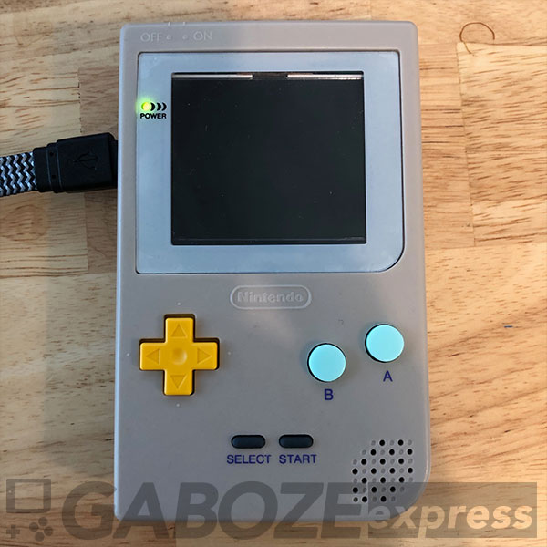
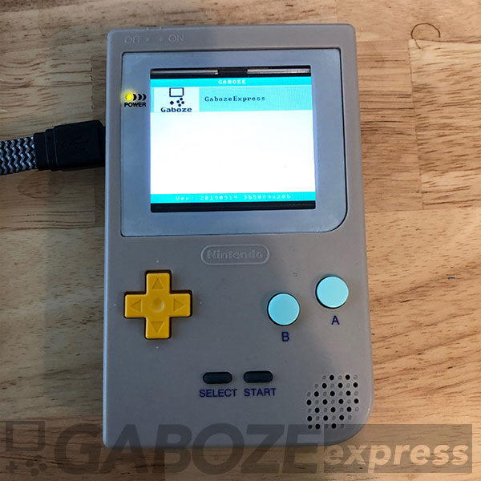
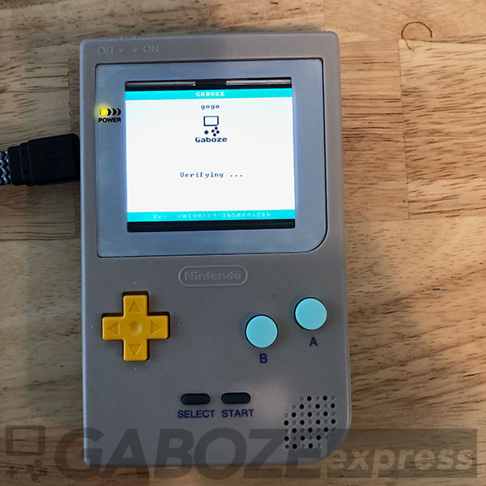
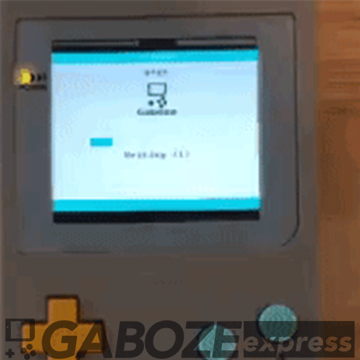

# 
> Software Branch

This branch contains the specific modification for the Odroid Go hardware to use the 320x240 ILI9342 2.6" display

- [x] Odroid Go - [Firmware](https://github.com/OtherCrashOverride/odroid-go-firmware)
- [x] Odroid Go - [Go Play Emulators](https://github.com/OtherCrashOverride/go-play)
- [x] Launcher based on [GoGo](https://bitbucket.org/odroid_go_stuff/gogo/src/master/) Launcher 

## Usage
> How To

Clone the Software Branch of the [Official Gaboze Express](https://github.com/gaboze-express/GabozeExpress)

```shell
$ git clone -b Software --single-branch git@github.com:gaboze-express/GabozeExpress.git --recursive
```

### firmware.sh
> inside scripts folder

Navigate to the /scripts folder of your newly cloned repository and set permission for ```firmware``` shell file

##### permissions for  firmware file

```shell
$ chmod 777 firmware
```

##### execute the firmware file
> follow the prompts on screen
> if this is your first time running the executable, answer **Y** to the options
```
$ ./firmware
```

You will now have a file called **GabozeExpress.fw** in the Firmware folder. 

You can copy this onto your *SD Card* into the ***odroid/firmware*** folder

## Enabling new firmware
> Insert the sd card into your Gaboze Express (Odroid Go) and follow the prompts

| Step     | Image                                     |
| -------- | ----------------------------------------- |
| Power On |  |
| Firmware List |  |
| Firmware Selection |  |
| Firmware Verification |  |
| Firmware Write |  |
| Reboot into new Firmware |  |


