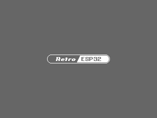
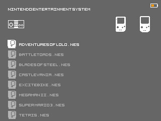
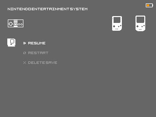
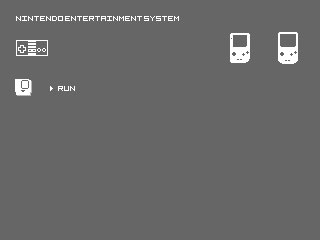
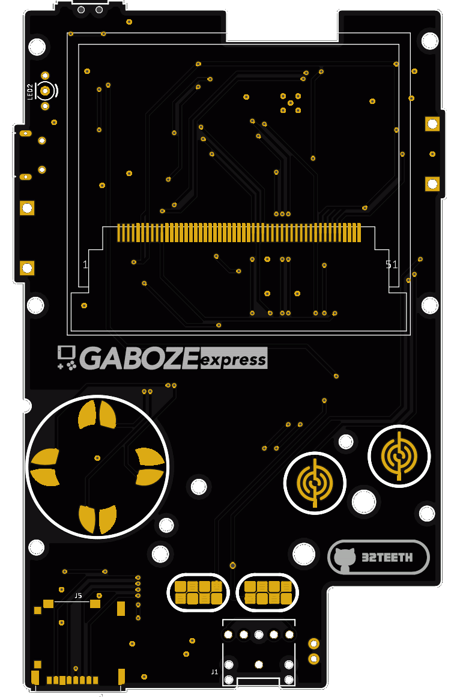
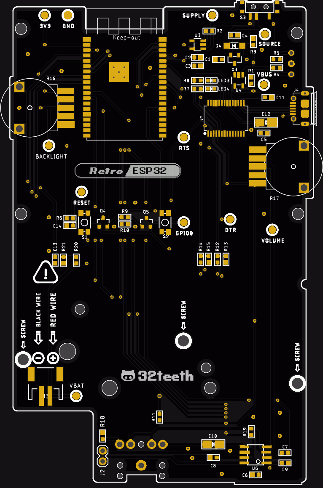

------
#### Buy Us A Coffee
> It's Not Mandatory, But Much [Appreciated](https://www.paypal.me/32teeth/1.99USD)

We work tirelessly to bring you the best **Odroid GO** and **Retro ESP32** user experience.

Everything we provide is free to use, Feedback is always welcome.

If you like what you see, and feel like giving us additional support, we accept **PayPal** donation of $1.99 USD, that's like, 1 coffee. But fee free to change the amount. We won't shy away!

*Thank You*
Retro ESP32 Team

------

# 
> An ESP32 Wrover based Game Boy Pocket

## Welcome

Based on the popularity of: 
- [Gaboze Pocaio](https://github.com/32teeth/GabozePocaio-Round1)
- [Gaboze Pocaio Round 2](https://github.com/32teeth/GabozePocaio-Round2)

## Supported Emulators
>What else do you need to do

- [x] Nintendo Entertainment System
- [x] Nintendo Game Boy
- [x] Nintendo Game Boy Color
- [x] Sega Master System
- [x] Sega Game Gear
- [x] Colecovision
- [x] Sinclair Zx Spectrum 48k
- [x] Atari 2600
- [x] Atari 7800
- [x] Atari Lynx

We have assemebled a team to pursue the development of:

* [**Software Branch**](https://github.com/retro-esp32/RetroESP32/tree/Software)
  * Including Custom Launcher:
    * Themable
    * Include Atari 2600, Atari 7800 and Commodor 64

|   Splash   |   Navigation   |   ROM State Management   |   Run   |
| ---- | ---- | ---- | ---- |
|      |     |     |     |

* [**Hardware Branch**](https://github.com/retro-esp32/RetroESP32/tree/Hardware)

### Hardware
> Testing FTDI Solution

Thanks to a recent contribution, we will be testing out the replacement of the CP2104 USB to UART bridge IC with an FTDI FT232RL IC

The FTDI IC is more hand solder friendly than the CP210x QFN series

Here is a teaser of what we are testing

| Top Layout | Bottom Layout |
| ------------------ | ---------------- |
|  |  |

  

A **new** *Game Boy Pocket* footprint based on the [ESP32 Wrover](https://www.espressif.com/en/products/hardware/esp32/overview) from [Espressif Systems](https://www.espressif.com)

### Why?

We love [Hard Kernel](https://www.hardkernel.com/) and their amazing product base including the [Odroid GO](https://www.hardkernel.com/shop/odroid-go/)

We wanted to design, build and solution on trusted ***<abbr title="System on a Chip"><u>SoC</u></abbr>***. The ESP32 Wrover was selected for ease of use and extensive build tools available across all development platforms

### What?

The **Gaboze Express** is intended as an educational *'toy'* for the world of **Makers**
A low barrier to entry and NO soldering experience needed, AT ALL, there is NOTHING to solder, plug in and go!

It has full support for

- [x] ESP-ISP Dev Toolchain
- [x] Arduino Toolchain
- [x] Whatever else you want to throw at it

### More Soon
> Stay Tuned

* Be sure to **Star** or **Fork** the repo as it will be updated often 

* Pull Requests are welcome

* Join the [Organization](https://github.com/gaboze-express) 

  * *Once you have forked or starred one of the repositories, you will receive an invite to join*

  

